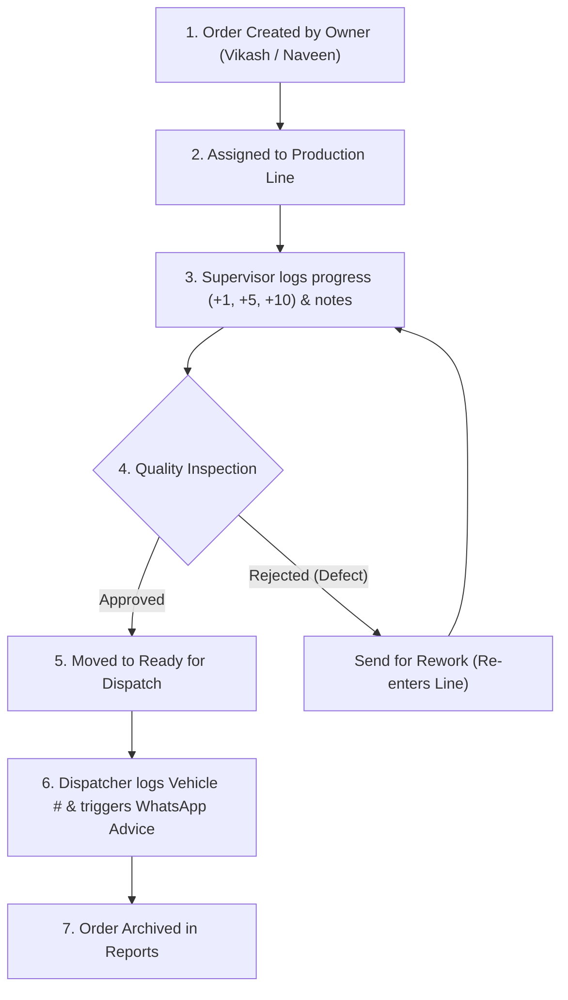

# ASHAPURI TUFF — FACTORY ENTERPRISE PORTAL
## Official Client Operating Manual, System Architecture & Commercial Invoice

**Tagline:** *STRENGTHENING YOUR GLASS*  
**Client:** Ashapuri Tuff (Vikash & Naveen)  
**Location:** Morbi-Rajkot Industrial Zone, Gujarat  
**GitHub Repository:** `https://github.com/himeshh704/tuff-internal-portal.git`  
**Document Version:** 2.0 (Production Release)

---

## 1. Executive Summary & Core Purpose

Welcome to the official operating workbook and technical documentation for **Ashapuri Tuff Factory Portal**.

This enterprise application replaces paper job slips, phone calls, and manual registers with a unified, real-time digital shop-floor management platform designed specifically for toughened glass processing plants.

### Key Capabilities Installed:
1. **Real-time Glass Processing Pipeline**: Tracks cutting, edging, washing, tempering, quality checking, and dispatching.
2. **Supervisor Ergonomic Progress Logging**: Shop-floor Supervisors log completed piece counts (`+1, +5, +10`) and notes on behalf of floor line workers without requiring worker logins.
3. **1-Click WhatsApp Dispatch & Order Advice**: Instant WhatsApp message generation with full glass specifications, vehicle numbers, and delivery advice links.
4. **Role-Based Security**: Strict JWT cookie session protection separated for Owners (Admins) and Shift Supervisors.

---

## 2. User Credentials & Access Matrix

| Role | Name / Identifier | Login Email / Username | Password | System Responsibilities |
| :--- | :--- | :--- | :--- | :--- |
| **Owner (Admin)** | Vikash | `vikash@ashapurituff.com` | `admin123` | Full System Access: Order creation, customer database, line assignment, quality checks, dispatching, financial reports. |
| **Owner (Admin)** | Naveen | `naveen@ashapurituff.com` | `admin123` | Full System Access: Order creation, customer database, line assignment, quality checks, dispatching, financial reports. |
| **Shift Supervisor** | Supervisor 1 (Shift A) | `supervisor1@ashapurituff.com` or `supervisor1` | `super123` | Shop-floor management: Send progress feedback, log piece counts, enter supervisor notes, mark jobs completed. |
| **Shift Supervisor** | Supervisor 2 (Shift B) | `supervisor2@ashapurituff.com` or `supervisor2` | `super123` | Shop-floor management: Send progress feedback, log piece counts, enter supervisor notes, mark jobs completed. |
| **Shift Supervisor** | Supervisor 3 (Shift C) | `supervisor3@ashapurituff.com` or `supervisor3` | `super123` | Shop-floor management: Send progress feedback, log piece counts, enter supervisor notes, mark jobs completed. |

> [!IMPORTANT]
> **Floor Line Workers do NOT log into the system directly.** Supervisors manage and report all production output on their behalf to maintain maximum security and operational simplicity on the shop floor.

---

## 3. What is What — Complete Feature & Module Breakdown

### 📊 A. Main Executive Dashboard
- **Live Line Health**: Visual status indicators for Line 01 (Cutting & Edging), Line 02 (Washing & Processing), and Line 03 (Furnace Tempering & Quality).
- **Metric Cards**: Total Active Orders, Pending Square Meters of Glass, Finished Pieces, and Dispatched Orders.
- **Urgent Notifications**: Displays orders nearing target delivery dates.

### 📦 B. Order Management View
- **+ Create Order**: Form to enter Customer Name, Contact Number, Delivery Date, Priority (Normal / Express / Urgent), and detailed Glass Items.
- **Glass Specification Matrix**: Input Thickness (4mm, 5mm, 6mm, 8mm, 10mm, 12mm), Dimensions in mm (Height × Width), Quantity, Glass Type (Clear, Frosted, Tinted, Low-E), and Edge Processing (Rough / Flat Polish / Beveled).
- **Order Lifecycle**: `New` ➔ `In Production` ➔ `Needs Checking` ➔ `Ready for Dispatch` ➔ `Dispatched`.

### 🏭 C. Shop Floor Production View
- **Line Assignment Engine**: Owners/Supervisors assign order glass items to specific line machines and shift workers.
- **⚡ Send Floor Progress Feedback**: Modal for Supervisors to:
  - Add completed piece increments (`+1`, `+5`, `+10` or custom number).
  - Type line progress notes (e.g. *"Cutting & edging completed for 15 pcs, ready for tempering furnace"*).
  - Mark item 100% complete to forward to Quality Inspection.

### 🔍 D. Quality Checking & Rework Queue
- **Inspection Queue**: Displays completed glass lots awaiting quality approval.
- **Approve & Mark Ready**: Moves order directly to Dispatch Staging.
- **Send for Rework**: If defects or breakage occur during tempering/polishing, Supervisors log rework notes (e.g. *"2 pieces broken during tempering - recutting required"*), moving the item back to production without losing original logs.

### 🚚 E. Dispatch & WhatsApp Advice Engine
- **Dispatch Staging**: Shows orders marked ready by Quality Inspection.
- **Vehicle & Driver Logging**: Enter transport vehicle registration (e.g. `GJ-03-AT-9988`) and driver contact.
- **💬 1-Click WhatsApp Dispatch Advice**: Generates a pre-formatted WhatsApp Web advice link containing:
  - Customer Name & Order #
  - Detailed Glass Specifications breakdown (Thickness, Size, Quantity)
  - Vehicle Registration Number
  - Dispatch Timestamp & Driver Contact

### 👥 F. Customer Directory
- Customer profiles with total order history, active jobs, and total business volume.
- Instant **💬 WhatsApp Notice** trigger for sending direct order updates.

### 📈 G. Reports & Analytics
- Monthly glass processing volume (in Square Meters & Total Pieces).
- Shift efficiency breakdown (Shift A vs Shift B vs Shift C output).
- Exportable CSV datasets for accounting and billing.

---

## 4. Daily Operational Workflow (Step-by-Step)



---

## 5. OFFICIAL COMMERCIAL INVOICE & BILLING SUMMARY

```
===================================================================================================
                                  ASHAPURI TUFF — COMMERCIAL INVOICE
                                   "STRENGTHENING YOUR GLASS"
===================================================================================================
Invoice Number : AT-INV-2026-001                                     Invoice Date : 23-SEP-2026
Client Name    : Ashapuri Tuff (Vikash & Naveen)                    Payment Terms: Due Net 15
Location       : Morbi-Rajkot Highway, Gujarat                       Currency     : INR (₹)
===================================================================================================

ITEM DESCRIPTION & TECHNICAL BREAKDOWN                                                 AMOUNT (INR)
---------------------------------------------------------------------------------------------------
1. Custom Toughened Glass Processing Architecture & Item Schema                       ₹ 10,000.00
   - Custom database schema for glass thickness (4-12mm), dimensions, edge polishes,
     and priority batch processing.

2. Role-Based JWT Security & User Access Control System                                ₹  8,000.00
   - Secure HTTP-only cookie authentication for 2 Admin Owners (Vikash & Naveen) and 
     3 Shift Supervisors with generic shift role authorization.

3. Shop-Floor Production Feedback Engine & Piece Counter                               ₹  7,000.00
   - Ergonomic +1, +5, +10 quick touch piece counter modal with line note logging for 
     shift supervisors without worker portal overhead.

4. 1-Click WhatsApp Dispatch & Order Advice Engine                                     ₹  7,000.00
   - Automated wa.me URL generator for sending instant glass specs, vehicle numbers, 
     and dispatch advice directly to customers.

5. Quality Rework Tracking & Dispatch Vehicle Tracker                                  ₹  6,000.00
   - Inspection queue, defect rework tracking, transport truck registration logging, 
     and monthly PDF/CSV report exporter.
---------------------------------------------------------------------------------------------------
SUBTOTAL SYSTEM VALUATION                                                             ₹ 38,000.00
Partner / Preferred Client Discount                                                 - ₹ 26,000.00
---------------------------------------------------------------------------------------------------
TOTAL PAYABLE AMOUNT DUE                                                              ₹ 12,000.00
===================================================================================================

BANK & PAYMENT DETAILS:
- Account Name   : Software Development Services
- Payment Mode   : UPI / IMPS / Bank Transfer
- Reference      : Ashapuri Tuff Portal Development (AT-INV-2026-001)

===================================================================================================
```

---

## 6. System Verification & Sign-Off

This document certifies that the **Ashapuri Tuff Factory Enterprise Portal** has been fully developed, tested against static production builds (`npm run build`), updated with official branding and logos, and pushed to the GitHub repository.

**Client Signature (Ashapuri Tuff):** ___________________________   **Date:** _______________

**Development Team Signature:** _______________________________   **Date:** _______________

